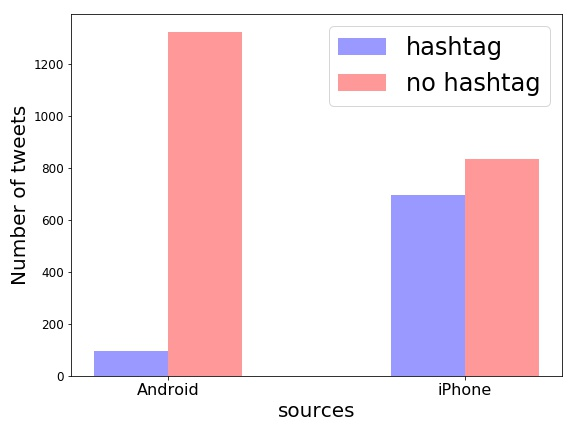

# Twitter Analysis: Trump

Extract the tweets of Donald J. Trump (@realDonaldTrump). Analyze his tweeting style by visualization. Specifically, we find that the [work](http://varianceexplained.org/r/trump-tweets/) by David Robinson inspiring. Based on his conclusion, we move further to analyze Trump himself's twitting style.

## Data Description
By [twitter API](https://dev.twitter.com/overview/api), we use [Tweepy](http://tweepy.readthedocs.io/en/v3.5.0/) to get the tweeters of a single user.
Because of the constraint of the API, only the most recent 3200 tweets of one user are available.

## Android and iPhone
David Robinson's [work](http://varianceexplained.org/r/trump-tweets/) tried to prove that for Trump, the Android and iPhone tweets are clearly from different people.

  

  

