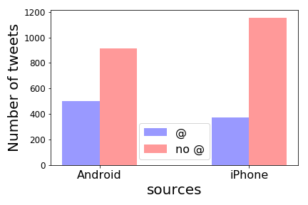

Extract the tweets of Donald J. Trump (@realDonaldTrump). Analyze his tweeting style by visualization. Specifically, we find that the [work](http://varianceexplained.org/r/trump-tweets/) by David Robinson inspiring. Based on his conclusion, we move further to analyze Trump himself's twitting style.

## Data Description
By [twitter API](https://dev.twitter.com/overview/api), we use [Tweepy](http://tweepy.readthedocs.io/en/v3.5.0/) to get the tweeters of a single user. Details of data set are in the [data book](databook.pdf)

### Data Acquirement

As one of the most popular social platform in the world, Twitter provides developers with powerful API to acquire and analyze tweet data. In this project, we use Python module Tweepy to get data from twitter API.
Since Twitter API is protected by OAuth(unlike the fully opened API we have worked with in class), we firstly registered a twitter development account and get the authorized key and secret from twitter and then get the tweets data from web. Considering the efficiency and interpretation of data, we only extracted interested data(details see in databook). Also, because of the constraint of the API, only the most recent 3200 tweets of one user are available so the size of our dataset is around 3200 and dated back to around Trump's tweet in 2016-3-27.

### Visualization
During this period, Trump participate election. Almost all the big events are listed in this [timeline](https://en.wikipedia.org/wiki/United_States_presidential_election,_2016_timeline#May_2016).

## Android and iPhone
David Robinson's [work](http://varianceexplained.org/r/trump-tweets/) tried to prove that for Trump, the Android and iPhone tweets are clearly from different people.

  

    
  

  

    Most of the hashtags are from iPhone. Actually tweets from the iPhone were 12 times more likely to contain a hashtag compared with Android.
  

  

    
  

  

    On the other hand, most of the quoted tweets are posted from the Android.
  

  

    
  

  

    Another behavior in twittering is to "@" other users. More tweets from Android contain "@" than iPhone.
  

  

    
  

  

    It turns out that the difference between the usage of link and media are extremely different. Tweets from the iPhone were 46 times as likely to contain either media or a link. 
  

