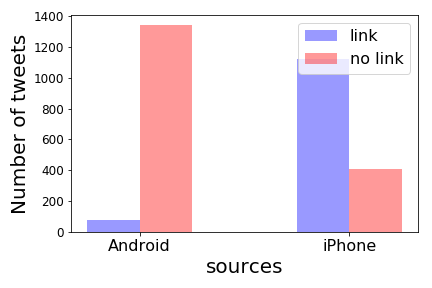

Extract the tweets of Donald J. Trump (@realDonaldTrump). Analyze his tweeting style by visualization. Specifically, we find that the [work](http://varianceexplained.org/r/trump-tweets/) by David Robinson inspiring. Based on his conclusion, we move further to analyze Trump himself's twitting style.

## Basic Idea:
David Robinson has showed us great work analyzing Trump’s tweet data. Enlighted by this, we also want to do some research about this problem from other aspects. Expect text itself,there are also other important features of tweet data which show interesting inference of his personality and tweeting style.

 Firstly, We are really interested in the general time pattern of trump’s tweets. Generally speaking, we want to analyze his tweeting frequency with date and try to find the peaks in it. Presumably, the date of this tweeting peaks should correspond to some particular political event. And the plots and other results here actually confirmed our assumption 

 On the other hand, we also want to study the difference of the tweeting time pattern and tweeting style of tweets from different data source. Through comparing the time pattern and tweeting style, we want to identify whether or not tweets from different source are actually tweeted by different people. Also data analysis about hashtags and users mentioned in tweets provides supporting details and evidence

## Data Description
By [twitter API](https://dev.twitter.com/overview/api), we use [Tweepy](http://tweepy.readthedocs.io/en/v3.5.0/) to get the tweeters of a single user. Details of data set are in the [data book](databook.pdf)

### Data Acquirement

As one of the most popular social platform in the world, Twitter provides developers with powerful API to acquire and analyze tweet data. In this project, we use Python module Tweepy to get data from twitter API.
Since Twitter API is protected by OAuth(unlike the fully opened API we have worked with in class), we firstly registered a twitter development account and get the authorized key and secret from twitter and then get the tweets data from web. Considering the efficiency and interpretation of data, we only extracted interested data(details see in databook). Also, because of the constraint of the API, only the most recent 3200 tweets of one user are available so the size of our dataset is around 3200 and dated back to around Trump's tweet in 2016-3-27.

### Visualization
During this period, Trump participated and won the election in the end. Almost all the big events are listed in this [timeline](https://en.wikipedia.org/wiki/United_States_presidential_election,_2016_timeline#May_2016).

Considering the large amount of tweets he has posted until now, we plotted his daily tweet numbers through the timeline. And we figured out some special dates when he posted extremely frequently. Compared with this timeline, we could see that all of them are related to important TV debates, including president debates and vice president debate. They're labeled in the graph clearly. As we all know, these debates have plenty of public attention. Trump grasped these key moment to raise his popularity and influence on American public further by increasing the numbers of his tweets.

We also visualized data after splitting the data set into android and iPhone two parts. To compare the public attention between them, we compare the hourly favorite and retweet numbers.

After removing the effect of tweet numbers, we may see that their patterns seems similar to each other. Information from Android sources received a little more attention than iPhone after the morning time, which is surprisingly opposite with the tweet number situation. And in the morning, tweets attraction are relatively alike.

## Android and iPhone
David Robinson's [work](http://varianceexplained.org/r/trump-tweets/) tried to prove that for Trump, the Android and iPhone tweets are clearly from different people.

  

    
  

  

    Most of the hashtags are from iPhone. Actually tweets from the iPhone were 12 times more likely to contain a hashtag compared with Android.
  

  

    
  

  

    On the other hand, most of the quoted tweets are posted from the Android.
  

  

    
  

  

    Another behavior in twittering is to "@" other users. More tweets from Android contain "@" than iPhone.
  

  

    
  

  

    It turns out that the difference between the usage of link and media are extremely different. Tweets from the iPhone were 46 times as likely to contain either media or a link. 
  

  

    
  

  

    It turns out that the difference between the usage of link and media are extremely different. Tweets from the iPhone were 46 times as likely to contain either media or a link. 
  

### Sentiment Analysis
First based on a corpus called "sentiwordnet" in module nltk, we are able to find the positive/negative score for each word.
Then we define a function to get the average the scores for all the words(delete stopwords at first) in a tweet text. 
So we can find whether one tweet is positive or negative.
<table style="width:80%">
  <tr>
    <th>source</th>
    <th>Twitter for Android</th> 
    <th>Twitter for iPhone</th>
    <th>All</th>
  </tr>
  <tr>
    <td>positive</td>
    <td>839</td> 
    <td>1123</td>
    <td>1962</td>
  </tr>
  <tr>
    <td>negative</td>
    <td>579</td> 
    <td>405</td>
    <td>984</td>
  </tr>
  <tr>
    <td>All</td>
    <td>1418</td>
    <td>1528</td>
    <td>2946</td>
  </tr>
</table>
The proportion of negative tweets from Android(40.8%) are much higher than that for iPhone(26.5%). Then we apply chi-square test.
We find that the difference is signifiant. (p-value = 2.23e-86)

We use Obama's tweets as a comparison. The proportion of negative tweets is 25.1%. The proportion of Trump's iPhone is close to Obama's. However, Trump's Android is extremely high.

## More Results
Also, for Trump, we want to see whether his tweets' ratio of negative change over times.

Based on these two Twitter source (Android and iPhone), we make a plot of the ratio of negative tweets and the total among of tweets in each week. In the time points when there is a peak of negative ratio of Android, we can find some events corresponing to them.
- 2016-05-09: Twitter war between Trump and Elizabeth Warren.
- 2016-07-02: Hillary Clinton's corruption scandal.
- 2016-07-12: Trump attacked Justice Ruth Bader Ginsburg.
- 2016-07-23: Wikileaks leaked 20000 emails revealed a bias against Bernie Sanders from the Democatic Party. 
- 2016-09-09: Hillary's "Basket Of Deplorables"
- 2016-10-07: Sexual misconduct accusations against Trump.
- 2017-01-09: Meryl Streep's speech.
- 2017-01-20: Inauguration.
- 2017-02-13: Michael Flynn resigned.
